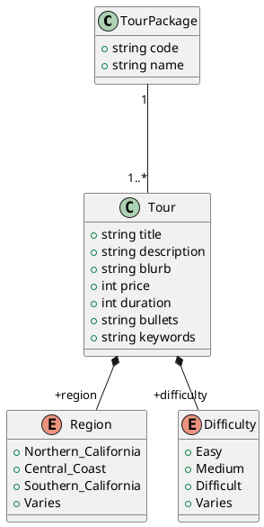

# Class

## Tour Package

```plantuml
@startuml

class TourPackage{
    + string code
    + string name
}

class Tour{
    + string title
    + string description
    + string blurb
    + int price
    + int duration
    + string bullets
    + string keywords
}

enum Region{
    + Northern_California
    + Central_Coast
    + Southern_California
    + Varies
}

enum Difficulty{
    + Easy 
    + Medium
    + Difficult
    + Varies
}

TourPackage "1" --- "1..*" Tour
Tour *-- "+region" Region
Tour *-- "+difficulty" Difficulty

@enduml
```